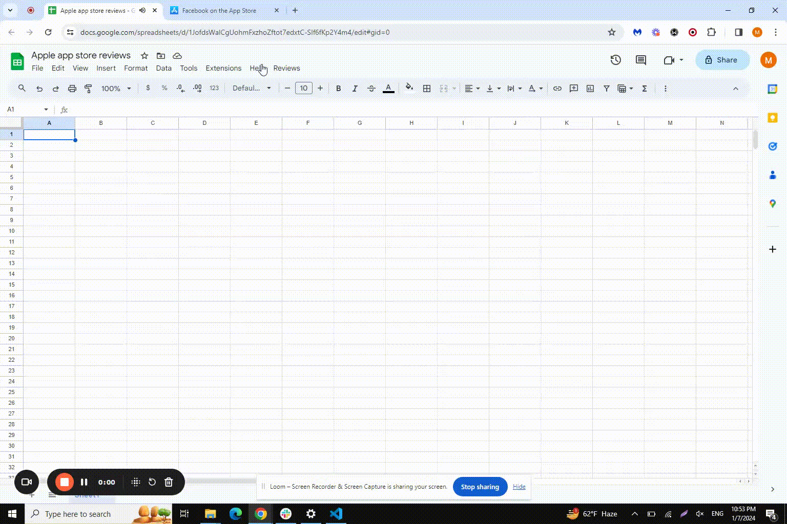

# Google Sheets Add-on for App Store Reviews and Sentiment Analysis

This Google Sheets add-on enables users to fetch reviews from the Apple App Store and perform sentiment analysis using the Google Cloud Platform's Natural Language API. It features a user-friendly sidebar interface for ease of use directly within Google Sheets.

## Features

- **Fetch App Reviews**: Automatically retrieve app reviews from the Apple App Store.
- **Sentiment Analysis**: Analyze review sentiments using GCP's Natural Language API.
- **User-Friendly Interface**: Operate directly from a custom sidebar in Google Sheets.
- **Color-Coded Results**: Sentiment scores are displayed with color coding for easy interpretation.

## Prerequisites

- A Google Cloud Platform account with access to the Natural Language API.
- A Google Sheets document.
- Basic understanding of Google Apps Script.

## Setup Instructions

### Step 1: GCP Service Account and API Configuration

1. **Create a Service Account**: Set up a new service account in your GCP console and download the JSON key.
2. **Enable the Natural Language API**: Make sure the API is enabled for your GCP project.
3. **Securely Store the Credentials**: Keep your JSON key safe and secure.

### Step 2: Google Sheets Script Setup

1. **Create or Open a Google Sheet**: This will be used with the add-on.
2. **Open the Script Editor**: Go to `Extensions` > `Apps Script` in your Google Sheet.
3. **Implement the Script**: Paste the provided Google Apps Script into the editor.
4. **Configure Credentials**: Add your service account details to the script.

### Step 3: Using the Add-on

1. **Open the Sidebar**: Use the sidebar interface in Google Sheets for operations.
2. **Fetch Reviews**: Enter an App ID and click `Fetch Reviews`.
3. **Run Sentiment Analysis**: Click `Analyze Sentiment` to analyze the reviews.

## How to Use

- **Fetching Reviews**: Enter the App ID (e.g., `284882215` for Facebook) in the sidebar and click the `Fetch Reviews` button.
- **Sentiment Analysis**: After fetching reviews, click `Analyze Sentiment` to categorize the sentiments.
- **View Results**: Sentiment analysis results are color-coded in the Google Sheet.

## Video Tutorial

For a detailed guide on how to use the add-on, refer to this video tutorial:

